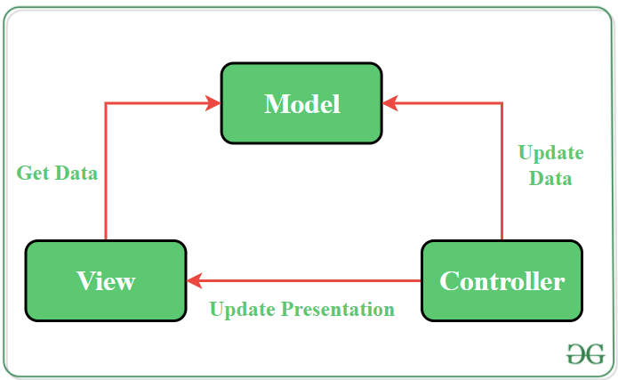
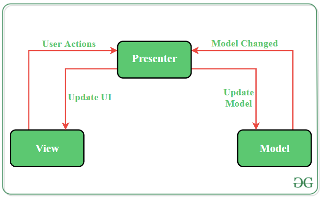
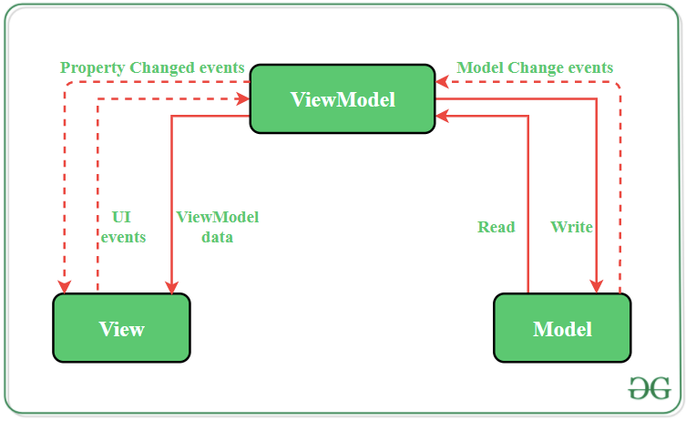

# Android Architecture

## MVC

- **Model:** **Stores** the **application data**. Be responsible for handling the **domain logic(real-world business rules)** and communication with the database and network layers.
- **View:** It is the **UI**(User Interface) **layer** that holds components that are visible on the screen. Moreover, it provides the **visualization of the data stored in the Model** and offers interaction to the user.
- **Controller:** Establishes the **relationship** between the View and the Model. It contains the core **application logic** and gets informed of the user’s response and **updates the Model** as per the need.

## MVP

- **Model:** Layer for **storing data**. It is responsible for handling the **domain logic**(real-world business rules) and communication with the database and network layers.
- **View:** **UI**(User Interface) **layer**. It provides the **visualization of the data** and keep a **track** of the **user’s action** in order to **notify the Presenter**.
- **Presenter:** **Fetch the data from the model** and **applies the UI logic** to decide what to display. It **manages the state of the View** and **takes actions** according to the user’s input **notification from the View**.

## MVVM

- **Model:** Be responsible for the **abstraction of the data sources**. Model and ViewModel **work together** to get and save the data.
- **View:** **Inform the ViewModel** about the user’s action. **Observes the ViewModel** and does **not contain** any kind of **application logic**.
- **ViewModel:** It **exposes** those **data** streams which are **relevant to the View**. Moreover, it servers as a **link** between the Model and the View.

## Differences

| MVC | MVP | MVVM |
| --- | --- | --- |
| User interact with View and Controller applies logic and updates Model. View gets data from Model. | User interact with View and View notifies Presenter. Presenter applies logic and updates Model and View. | Use data binding so View and ViewModel are notified automatically. |
| View and Model are tightly coupled. | Use Presenter as a communication channel between Model and View. | Use data binding to separate the data presentation logic from the core business logic of the application. |
| One Controller maps multiple Views. One Controller can select a different View based upon required operation. | One Presenter maps to one View. One Presenter class manages one View at a time. | One ViewModel maps to multiple Views. |