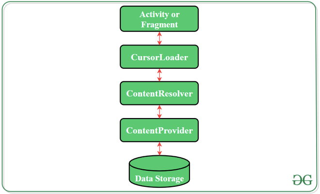

# Content Provider

<aside>
💡 Store data of the application and it facilities other applications to securely access and modify data in this application.

</aside>

## Content URI

To access data from a content provider, URI is used as a query string.

$$
content://authority/optionalPath/optionalID
$$

- **content:// -** Mandatory part which represents a Content URI.
- **authority -** Signifies the name of the content provider. Must be unique.
- **optionalPath -** Specifies the type of the data.
- **optionalID -** A numeric value used for a particular record.
- Example:

```kotlin
		// defining authority so that other application can access it
    static final String PROVIDER_NAME = "com.demo.user.provider";
  
    // defining content URI
    static final String URL = "content://" + PROVIDER_NAME + "/users";
  
    // parsing the content URI
    static final Uri CONTENT_URI = Uri.parse(URL);
```

## Working of Content Provider



### Create Content Provider Class

Implement `query()`, `insert()`, `update()`, `delete()`, `update()`, `onCreate()` methods and operate the database.

### In MainActivity of Same Application

- put data like this:

```kotlin
				// class to add values in the database
        ContentValues values = new ContentValues();
  
        // fetching text from user
        values.put(MyContentProvider.name, ((EditText) findViewById(R.id.textName)).getText().toString());
  
        // inserting into database through content URI
        getContentResolver().insert(MyContentProvider.CONTENT_URI, values);
```

- retrieve data like this:

```kotlin
				// creating a cursor object of the content URI
        Cursor cursor = getContentResolver().query(Uri.parse("content://com.demo.user.provider/users"), null, null, null, null);
  
        // iteration of the cursor to print whole table
        if(cursor.moveToFirst()) {
            StringBuilder strBuild=new StringBuilder();
            while (!cursor.isAfterLast()) {
                strBuild.append("\n"+cursor.getString(cursor.getColumnIndex("id"))+ "-"+ cursor.getString(cursor.getColumnIndex("name")));
                cursor.moveToNext();
            }
            resultView.setText(strBuild);
        
```

### In MainActivity of Different Application

Add certain URI and put && retrieve data same as in same application.

```kotlin
Uri CONTENT_URI = Uri.parse("content://com.demo.user.provider/users");
```
