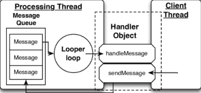

# Handler

## Uses of Handler

1. **Scheduling** of messages and runnables that need to be executed in the future.
2. **Enqueueing** actions that need to be performed in the background thread.

## Handler and Looper

### Looper

> **Dispatch** work on its message-loop thread.
> 

### Handler

- **Submit** messages to its Looper queue.
- Implement the `callback` for processing those messages.

<aside>
💡 Refer to [Handler in Android](https://camposha.info/android-examples/android-handler/#gsc.tab=0) for more information.

</aside>