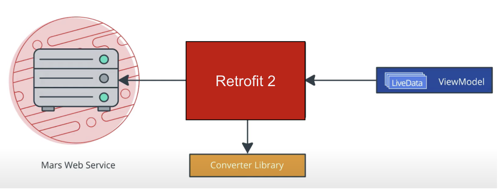

# Retrofit

<aside>
💡 Retrofit fetches data from the web service and routes it through a converter library that know how to decode data and return it in the form of objects like String. It supports popular data formats like XML and JSON.

</aside>



## Work with Retrofit

1. Create a Retrofit object with **base URL** and **converter factory**.
2. Create an **interface** that explains how Retrofit **talks to the web server**.
3. Create a **Retrofit service** and expose it to the rest of app.

```kotlin
package com.example.android.marsphotos.network

import com.squareup.moshi.Moshi
import com.squareup.moshi.kotlin.reflect.KotlinJsonAdapterFactory
import retrofit2.Retrofit
import retrofit2.converter.moshi.MoshiConverterFactory
import retrofit2.http.GET

private const val BASE_URL =
   "https://android-kotlin-fun-mars-server.appspot.com"

/**
* The Retrofit object with a converter fetching JSON response and return it as a    
* String.
*/
private val retrofit = Retrofit.Builder()
   .addConverterFactory(ScalarsConverterFactory.create())
   .baseUrl(BASE_URL)
   .build()

/**
* A public interface that exposes the [getPhotos] method
*/
interface MarsApiService {
   /**
    * The @GET annotation indicates that the "photos" endpoint will be requested 
		* with the GET HTTP method.
    */
   @GET("photos")
   suspend fun getPhotos() : List<MarsPhoto>
}

/**
* The call to create() is expensive and we only need one instance.
* Access same Singleton Retrofit object that implements MarsApiService.
*/
object MarsApi {
   val retrofitService: MarsApiService by lazy { 
				retrofit.create(MarsApiService::class.java) 
		}
}
```

4. How to use the service

```kotlin
val listResult = MarsApi.retrofitService.getPhotos()
```
